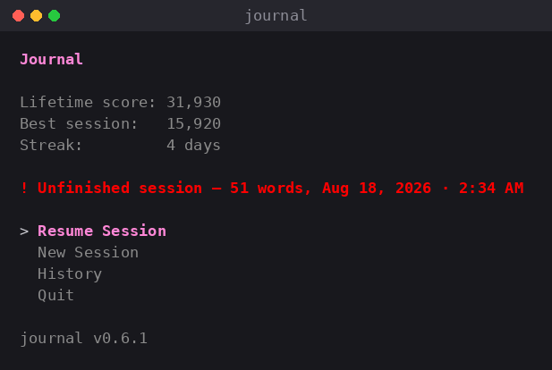
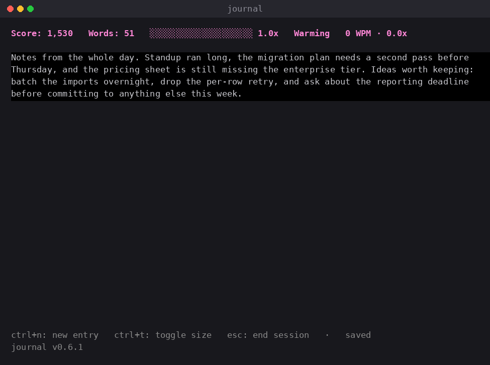

# journal

A gamified terminal journaling app: a live combo meter rewards uninterrupted
writing flow, a per-session score you try to beat, and a lifetime score that
only grows.

## Install

```
go install github.com/nd28/journal-tui/cmd/journal@latest
```

Requires Go 1.25+. This installs a `journal` binary to `$(go env GOPATH)/bin`
(make sure that's on your `PATH`).

## Run

```
journal
```

Data is stored in a local SQLite file at `~/.journal/journal.db`.

## Keys

While writing:

| Key | Does |
| --- | --- |
| `ctrl+n` | Finish the current entry and start a new one in the same session |
| `ctrl+t` | Toggle between full-screen and compact editor size |
| `esc` / `ctrl+d` | End the session and show the summary |
| `ctrl+c` | End the session and quit |

Reading past sessions in History (and in the Read screen):

| Key | Does |
| --- | --- |
| `enter` | Open the highlighted session |
| `ctrl+s` | Copy the session to the clipboard, ready to paste and share |
| `pgup` / `pgdn` | Page through results |
| `esc` | Go back |

A copied session carries its stat header — date, score, word count, intensity —
followed by the entry text, unstyled so it wraps to whatever you paste it into.
On a machine with no clipboard tool (a bare SSH session, say), the copy reports
an error rather than quietly copying nothing.

## Crash safety

The editor autosaves every 5 seconds, and the writing screen says `saved` or
`unsaved` so you never have to guess. If the app is killed mid-session — a
crash, a closed terminal, a battery that runs out — the next launch offers
the session back:



Resuming puts the text back in the editor and the score back on the header,
then carries on:

 The combo multiplier restarts at 1.0x: it measures the last
few seconds of typing, and the interruption ended those. Sessions that were
opened but never written in are cleaned up silently instead of being offered.

## Develop

```
make build   # build ./journal
make test    # go build + go vet + go test ./...
make run     # build and run
make install # go install ./cmd/journal
```
